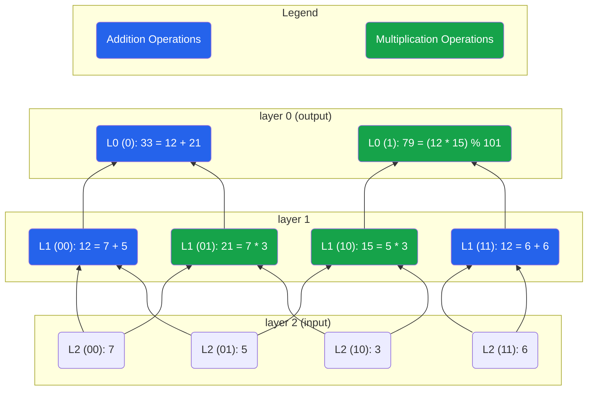

# GKR: Sumcheck's best friend

Today, let’s talk about GKR. I won’t go too deep into the details here. The goal is to keep this article relatively “light”, and I’ll link to some resources if you want to dive deeper.

The GKR protocol, introduced by Goldwasser, Kalai, and Rothblum in 2008, is an interactive proof system for verifying the correctness of computations represented as arithmetic circuits. It’s a natural extension of the Sumcheck protocol and works especially well for computations that can be expressed as layered circuits.

Suppose you have a computation that takes a large input and applies several layers of arithmetic operations to produce an output. Re-running the entire computation just to verify the output would be expensive. But what if the verifier could efficiently check the result without redoing all the work or blindly trusting the prover? Sounds familiar, right? That’s the Sumcheck spirit, and GKR builds on that.

## Layered circuit

GKR assumes an arithmetic circuit structured into `d` layers.

To keep things consistent, we’ll label the top layer (the output) as layer `0`, and increase the index as we go down to the input layer, which is layer `d`. Each gate in layer `i` performs an arithmetic operation (either addition or multiplication) on the outputs of two gates in layer `i + 1`.

I made a simple circuit as an example:

Layer 2 is our input layer [7, 5, 3, 6], and the circuit outputs [33, 79] (operations are in $\mathbb{F}_{101}$).

Since we’re working with multivariate polynomials, we use binary encodings for gate indices over the boolean hypercube (ex: `00`, `01`,…). That’s why I indicated `(00)`, `(01)`, …

The relationships between layer 2 and layer 1 gates can be written as:

$$
L_1(00) = L_2(00)+L_2(01) \\
L_1(01) = L_2(00)*L_2(10) \\
L_1(10) = L_2(01)*L_2(10) \\
L_1(11) = L_2(11)+L_2(11)
$$

But these aren’t in a form we can use directly with Sumcheck. To apply Sumcheck, we need to express each layer as a polynomial relation involving a sum over the boolean cube.

Something like:

$$
L_1=\displaystyle\sum_{b \in {\{0,1\}}^2}L_2(b)
$$

## Selector polynomials

We’ll define selectors that activate only when a gate applies a specific operation.

In our simple circuit, we have 2 types of gates: `add` and `mul`.

For instance, to compute the value at gate `a` in layer `i`, which connects to gates `b` and `c` in layer `i+1`, we write:

$$
L_i=\displaystyle\sum_{a \in {\{0,1\}}^{n_i}, \text{\ } b,c \in {\{0,1\}}^{n_{i+1}}}
\begin{pmatrix}
\text{ \ \ \ } \widetilde{add}(a,b,c)*(L_{i+1}(b)+L_{i+1}(c)) \\
+ \text{ } \widetilde{mul}(a,b,c)*(L_{i+1}(b)*L_{i+1}(c))
\end{pmatrix}
$$

> Note:
> `a` length depends on the number of gates in layer `i`,
> while `b` and `c` length depends on the number of gates in layer `i + 1`

These selector functions act like indicator functions: they evaluate to `1` when the triple `(a, b, c)` corresponds to a valid gate connection for that operation, and `0` otherwise.

`add` selector acts like this:

$$
\widetilde{add}=\begin{cases}
   1 &\text{if } L_i(a)=L_{i+1}(b)+L_{i+1}(c) \\
   0 &\text{otherwise}
\end{cases}
$$

Same for the mul selector.

## Multilinear extensions

To apply Sumcheck, we need polynomial selectors, so we take the multilinear extensions of these indicator functions. That’s why I added a `~` on top of `add` and `mul`.

In our example, for layer 2 to layer 1 connection, `a`, `b`, and `c` each represent 2-bit indices (since each layer has 4 gates). So the selectors are boolean functions over 6 variables: $(a_1, a_2, b_1, b_2, c_1, c_2)$.

The MLE of `add` will look like this:

$$
\widetilde{add}(a_1,a_2,b_1,b_2,c_1,c_2) = \\
((1-a_1)(1-a_2)(1-b_1)(1-b_2)(1-c_1)c_2) + (a_1*a_2*b_1*b_2*c_1*c_2)
$$

Do you understand why?

We have 2 addition gates in layer 1:

- when a=00, b=00 and c=01
- when a=11, b=11 and c=11

So this MLE evaluates to `1` at inputs `(00, 00, 01)` and `(11, 11, 11)`, . To make sure it’s clear, here are all the possible values for our `add` MLE:

$$
add(0,0,\text{ }0,0,\text{ }0,0)=0 \\
add(0,0,\text{ }0,0,\text{ }0,1)=1 \\
add(0,0,\text{ }0,0,\text{ }1,0)=0 \\
add(0,0,\text{ }0,0,\text{ }1,1)=0 \\
add(0,0,\text{ }0,1,\text{ }0,0)=0 \\
... \\
add(1,1,\text{ }1,1,\text{ }0,0)=0 \\
add(1,1,\text{ }1,1,\text{ }0,1)=0 \\
add(1,1,\text{ }1,1,\text{ }1,0)=0 \\
add(1,1,\text{ }1,1,\text{ }1,1)=1 \\
$$

Similarly, the `mul` selector is:

$$
\widetilde{mul}(a_1,a_2,b_1,b_2,c_1,c_2)=((1-a_1)a_2(1-b_1)(1-b_2)c_1(1-c_2))+(a_1(1-a_2)(1-b_1)b_2c_1(1-c_2))
$$

Again, this evaluates to `1` for the multiplication gates in our circuit, and `0` everywhere else.

## Layer `i` equation

With selectors and MLEs in hand, we now define the value of each gate in layer `i` as:

$$
L_i(x)=\displaystyle\sum_{b,c \in {\{0,1\}}^{n_{i+1}}}
\begin{pmatrix}
\text{ \ \ \ } \widetilde{add}(x,b,c)*(\widetilde{L_{i+1}}(b)+\widetilde{L_{i+1}}(c)) \\
+ \text{ } \widetilde{mul}(x,b,c)*(\widetilde{L_{i+1}}(b)*\widetilde{L_{i+1}}(c))
\end{pmatrix}
$$

We now have a Sumcheck-friendly expression for each layer!

## Protocol: step by step

Now that we’ve set the stage, let’s walk through how the GKR protocol works in practice.

The protocol proceeds **layer by layer**, from the output of the circuit back to the input. At each step, we use the **Sumcheck protocol** to verify that the values at layer `i` are correctly computed from the values at layer `i + 1`.

Since the verifier **only knows the circuit’s inputs and final outputs**, this recursive approach lets them verify the full computation with minimal effort.

> Notation:

- let $l_i$ be the values at layer `i`.
- $\widetilde{l_i}$ denote the MLE of the values at layer `i`
- $L_i$ be the layer's computation formula, expressed as a function of the next layer
  >

### Step 1: Start at the output layer

We begin at **layer 0**, the output layer.

The Verifier knows the output values and can compute the MLE: $\widetilde{l_0}$

### Step 2: Sample a random point

Verifier samples a random point $r_0 \in \mathbb{F}^{n_0}$, where $n_0 = \log_2(|l_0|)$

_(note: if the field is small, $r_0$ will be sampled from an extension)_

The verifier then evaluates $\widetilde{l_0}(r_0)$

Prover must now convince the Verifier that:

$$
\widetilde{l_0}(r_0) \stackrel{?}{=} \displaystyle\sum_{b,c \in {\{0,1\}}^{n_1}} L_0(r_0,b,c)
$$

### Step 3: Apply Sumcheck

We run the Sumcheck protocol on the RHS of the previous equation.

Recall:

To evaluate $L_0(r_0,b,c)$, we need:

- the `add` and `mul` MLEs for layer 0
- the value of $L_1(b)$ and $L_1(c)$.

Since the wiring of the circuit is fixed and known in advance (the `add` and `mul` gates), the Verifier can compute $\widetilde{add}(r_0,b,c)$ and $\widetilde{mul}(r_0,b,c)$ on their own.

The Prover supplies $L_1(b)$ and $L_1(c)$, **but we’ll need to verify them** (step 4).

During Sumcheck we sample random values for `b` and `c` (again, in a small field this is sampled from an extension field).

At the end of Sumcheck, we reduce the original sum to verifying:

$$
V_0 = \widetilde{add_{r_0}}(b,c)*(L_1(b)+L_1(c)) + \widetilde{mul_{r_0}}(b,c)*(L_1(b)*L_1(c))
$$

### Step 4: Recursion to the next layer

We now need to verify that $L_1(b)$ and $L_1(c)$ are correct. So we recurse to layer 1.

$$
L_1(b)=\displaystyle\sum_{x,y \in {\{0,1\}}^{n_2}}
\begin{pmatrix}
\text{ \ \ \ } \widetilde{add}(b,x,y)*(L_2(x)+L_2(y)) \\
+ \text{ } \widetilde{mul}(b,x,y)*(L_2(x)*L_2(y))
\end{pmatrix}
$$

and same thing for $L_1(c)$ (I changed the variable’s names to `x` and `y` to make it clear what we’re doing).

If we're not yet at the input layer, we recurse again.

Once we reach the input layer, the verifier can compute the values themselves and verify directly.

In our example layer 2 is indeed the input layer, so the values are public and the Verifier can compute himself $L_2(x)$ and $L_2(y)$.

### Alternative step 4: Optimization

I lied a bit in **Step 4**… we do **not** need to prove $L_1(b)$ and $L_1(c)$ **separately**.

Instead, we compute a **random linear combination**:

$$
\alpha L_1(b)+\beta L_1(c)
$$

Then we apply Sumcheck **once per layer** to verify this combined value. This reduces the number of rounds and communication cost.

## Try It Yourself

The GKR protocol might seem simple at first glance, but truly understanding it takes a bit of time and experimentation.

To help with that, I wrote a full Sage script that walks through the exact circuit we discussed in this article:

https://github.com/teddav/sumcheck-article/blob/main/gkr.sage

This article was just a high-level walkthrough. If you really want it to click, I recommend spending time with the code 😊

## Summary

- GKR applies Sumcheck recursively from output to input.
- Each layer’s correctness is reduced to verifying a low-degree polynomial identity.
- By combining values with randomness, the protocol remains efficient and secure.

💬 Questions or feedback? Feel free to DM me: [@0xteddav](https://x.com/0xteddav)

## Resources

https://taueflambda.dev/posts/gkr/

https://github.com/PolyhedraZK/awesome-expander/blob/main/blogs/gkr-by-hand.ipynb

https://xn--2-umb.com/24/gkr/

https://blog.lambdaclass.com/gkr-protocol-a-step-by-step-example/
